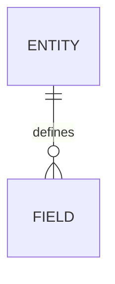

# DATABASE_SCHEMA Template

This document defines the required structure for `DATABASE_SCHEMA.md`.

## Compliance Rules

- Keep the `APM:DATA` managed block intact and valid JSON.
- Keep the top compliance note intact.
- Preserve the section order defined in this template.
- Keep Mermaid text valid and aligned with the schema editor state in the application.
- Treat `DATABASE_SCHEMA.md` as the schema design narrative; structural portability should be represented through generated DBML and schema fragments.
- If this template structure changes, update the version section before making any other structural edits.

## Version

- Template Name: `DATABASE_SCHEMA.template.md`
- Template Version: `1.0`
- Last Updated: `2026-03-29`
- AI Agent instruction: Whenever this template is updated, update the template version and last updated date before changing any section definitions.

## Model Context Protocol

- `DATABASE_SCHEMA.md` is a managed document generated from application state.
- The application database is the source of truth for schema editor fields, generated markdown, and Mermaid content.
- AI agents should preserve section headings and use the existing structure instead of inventing new top-level sections.
- Schema changes should remain consistent with architecture decisions, work-item relationships, migrations, and source-of-truth rules.
- Imported or AI-proposed schema changes should flow through `DATABASE_SCHEMA_FRAGMENT.template.md` rather than editing this narrative document directly.
- If a disk file conflicts with database state, the application may regenerate this file from the database.

## Structure Definition

The generated `DATABASE_SCHEMA.md` must contain the following sections in this order.

1. `# Database Schema: {{PROJECT_NAME}}`
2. Compliance note
3. Managed data block
4. `## 1. Schema Overview`
   - `### 1.1 Purpose`
   - `### 1.2 Storage Strategy`
5. `## 2. Entities`
6. `## 3. Relationships`
7. `## 4. Constraints`
8. `## 5. Indexes`
9. `## 6. Migration Notes`
10. `## 7. Source-of-Truth and Sync Rules`
11. `## Mermaid`

Repeating sections such as entities, relationships, constraints, indexes, and migration notes should use numbered subsection entries with a title and description.

## Example Skeleton

```md
# Database Schema: {{PROJECT_NAME}}

> Managed document. Must comply with template DATABASE_SCHEMA.template.md.

<!-- APM:DATA
{ ... }
-->

## 1. Schema Overview

### 1.1 Purpose

{{SCHEMA_PURPOSE}}

### 1.2 Storage Strategy

{{STORAGE_STRATEGY}}

## 2. Entities

### 1. Entity Name

{{ENTITY_DESCRIPTION}}

## Mermaid


```
