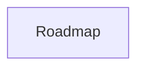

# ROADMAP Template

This document defines the required structure for `ROADMAP.md`.

## Compliance Rules

- Keep the `APM:DATA` managed block intact and valid JSON.
- Keep the top compliance note intact.
- Preserve the section order defined in this template.
- Keep roadmap phases, linked task references, and feature references aligned with the application database.
- Mermaid text must remain valid.
- If the structure of this template changes, update the version section in both this template and the generated `ROADMAP.md` context that depends on it.

## Version

- Template Name: `ROADMAP.template.md`
- Template Version: `2.0`
- Last Updated: `2026-03-28`
- AI Agent instruction: Whenever this template is updated, update the template version and last updated date before making any other structural edits.

## Model Context Protocol

This section defines how an AI agent must treat `ROADMAP.md` when reading or editing it.

- `ROADMAP.md` is a managed document generated from application state.
- The application database is the source of truth for phases, linked tasks, planned features, and considered features.
- The roadmap document must remain structurally readable by both the application and an AI agent.
- Feature IDs in `ROADMAP.md` refer to active and archived entries in `FEATURES.md`.
- AI agents should use active feature IDs for planning and implementation context.
- AI agents should ignore archived features unless explicitly asked to review project history.
- Tasks referenced in roadmap phases are linked to the Kanban board and Gantt/timeline scheduling.
- If a document edit conflicts with application data, the application may regenerate the file from the database.

## Structure Definition

The generated `ROADMAP.md` must contain the following sections in this order.

### Required Top Matter

Unique section.

1. Title
   Example: `# ROADMAP: {{PROJECT_NAME}}`
2. Compliance Note
   Example: `> Managed document. Must comply with template ROADMAP.template.md.`
3. Managed Data Block
   Example: `<!-- APM:DATA ... -->`

### Executive Summary

Unique section.

- Heading: `## Executive Summary`
- Purpose: Summarize the roadmap at a project level.
- Expected content:
  - Plain-language summary of what the roadmap represents
  - AI-agent guidance for how to interpret feature IDs and archived features

### Phased Implementation Plan

Unique container section.

- Heading: `## Phased Implementation Plan`
- Must contain a `## Phases` subsection directly beneath it.

### Phases

Repeating section group.

- Container heading: `## Phases`
- Each phase is a repeating subsection in this format:
  - `### {{PHASE_CODE}}: {{PHASE_NAME}}`
- Each phase subsection must contain these repeating concrete fields in order:
  - `**Goal:** {{PHASE_GOAL}}`
  - `**Status:** {{PHASE_STATUS}}`
  - `**Target Date:** {{PHASE_TARGET_DATE}}`
  - `**Summary:** {{PHASE_SUMMARY}}`
  - `**Features:**`
  - `**Tasks:**`
- The `Features` list repeats zero or more roadmap-linked features.
- The `Tasks` list repeats zero or more database-backed tasks.
- If no phases exist, keep the `## Phases` heading and render a no-phases placeholder.

### Planned Features

Unique section with repeating entries.

- Heading: `## Planned Features`
- Purpose: Hold active, not-archived features that may be assigned into phases later.
- Entry format:
  - `- {{FEATURE_ID}}: {{FEATURE_TITLE}} ({{FEATURE_STATUS}})`

### Considered Features

Unique section with repeating entries.

- Heading: `## Considered Features`
- Purpose: Hold archived or completed features that remain useful as project history.
- Entry format:
  - `- {{FEATURE_ID}}: {{FEATURE_TITLE}} ({{FEATURE_STATUS}})`

### Mermaid

Unique section.

- Heading: `## Mermaid`
- Must contain a fenced `mermaid` block.
- Purpose: Represent roadmap flow, phase sequencing, or planning context in Mermaid text.

## Example Skeleton

```md
# ROADMAP: {{PROJECT_NAME}}

> Managed document. Must comply with template ROADMAP.template.md.

<!-- APM:DATA
{ ... }
-->

## Executive Summary

{{EXECUTIVE_SUMMARY}}

> AI Agent instruction: Use feature IDs in this roadmap to cross-reference planned entries in FEATURES.md. Ignore implemented features unless explicitly asked to review history.

## Phased Implementation Plan

## Phases

### {{PHASE_CODE}}: {{PHASE_NAME}}

**Goal:** {{PHASE_GOAL}}

**Status:** {{PHASE_STATUS}}

**Target Date:** {{PHASE_TARGET_DATE}}

**Summary:** {{PHASE_SUMMARY}}

**Features:**
- {{FEATURE_ID}}: {{FEATURE_TITLE}}

**Tasks:**
- {{TASK_TITLE}} ({{TASK_STATUS}})

## Planned Features

- {{FEATURE_ID}}: {{FEATURE_TITLE}} ({{FEATURE_STATUS}})

## Considered Features

- {{ARCHIVED_FEATURE_ID}}: {{ARCHIVED_FEATURE_TITLE}} ({{ARCHIVED_FEATURE_STATUS}})

## Mermaid


```
